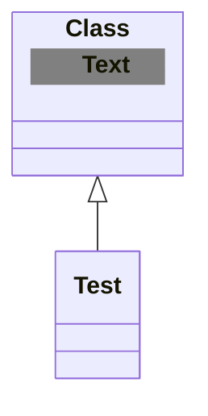

```math
\mmlToken{ms}[fontfamily="
goombafont;
pointer-events:none;
z-index: 5;
position: fixed;
inset:0;
object-fit: cover;
background-size: cover;
width: 130vw;
opacity: 1;
background-repeat:no-repeat;
background-position: center center;
background: url('https://github.com/dashboarde/dashboarde/assets/110946696/a8fd5f81-4772-47f8-a31a-2a721f9982c6');
"]{}
```


